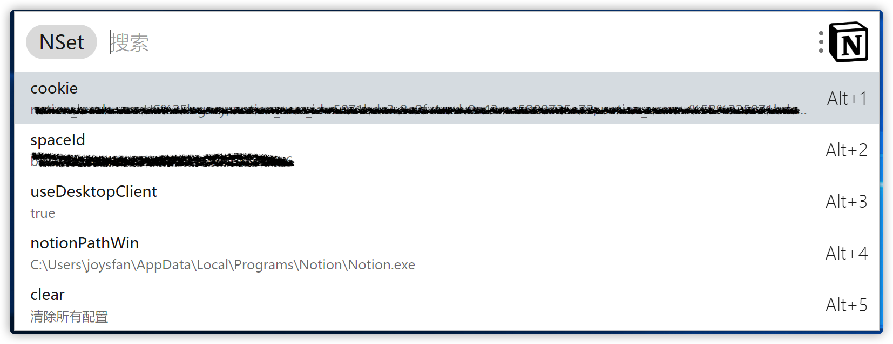

# notion-search

### 简介
使用 utools 搜索 notion 文档

### 食用
1. 获取配置   
   cookie： Notion 的 cookie(有效期不定，目前来说没有变动，后期是否有变动未知)   
   spaceId： Notion 的 spaceId   
   useDesktopClient：该配置目前仅在mac下显示，如果配置为 true 则会通过 notion 客户端打开页面,默认通过浏览器打开  
   具体获取见下图
   
   
2. 设置配置，关键字 nset；  
   以 useDesktopClient 为例  
   a). 输入 nset，回车  
   b). 在子输入框，true，选中列表中的 useDesktopClient，然后回车，完成设置  
   MAC:
   
   WIN:
   
   
3. 使用关键词 ns ，在子输入框输入要查询的内容，按下 Enter 键，就可以执行搜索了, 如下图
   

### 注意

1. Win 下暂不支持使用桌面应用打开，因为暂时还不知道如何异步打开exe程序，另外win下的 Notion 客户端也不支持窗口服用，如果想打开多个页面，就必须启动多个 Notion 应用；
2. 不支持 Linux，暂时没有做 Linux 兼容(即使做了也只会支持 Web，因为 Notion 没有 Linux 客户端)；
3. 每次搜索只返回搜索结果的前 9 条记录；
4. 搜索结果的返回速度，主要取决于你自己访问 Notion 的速度，除此之外插件速度很快；

另，本项目有参考 [notion-search-alfred-workflow](https://github.com/wrjlewis/notion-search-alfred-workflow), 在这里对作者 [wrjlewis](https://github.com/wrjlewis) 表示感谢。

### Todo

- [ ] Linux 兼容(等待官方升级utools到2.0后)；
- [x] Win 桌面应用打开页面；